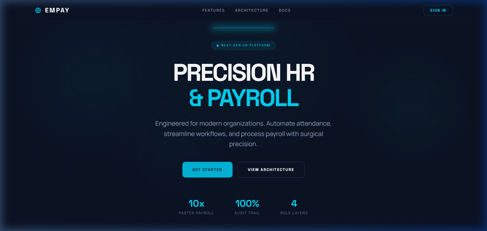
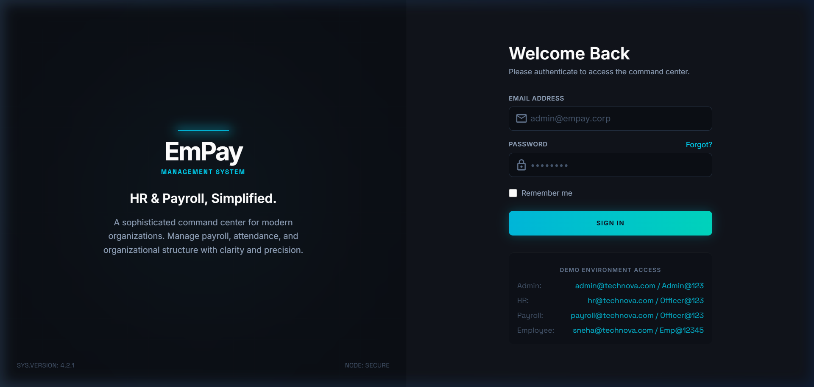
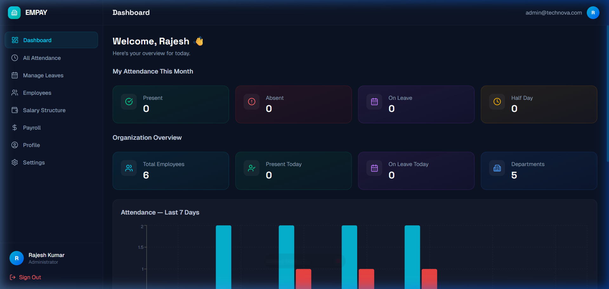
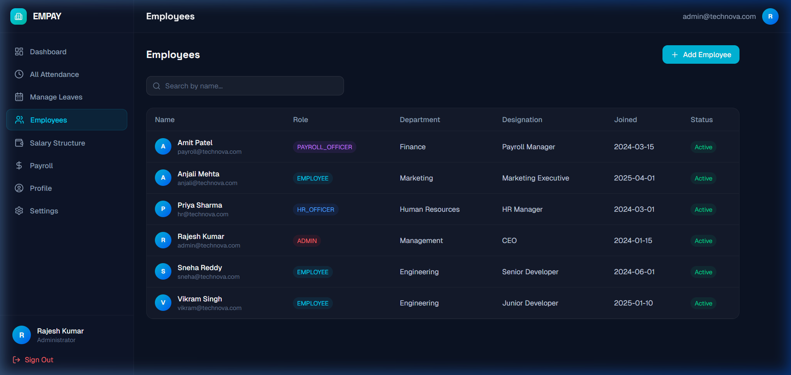
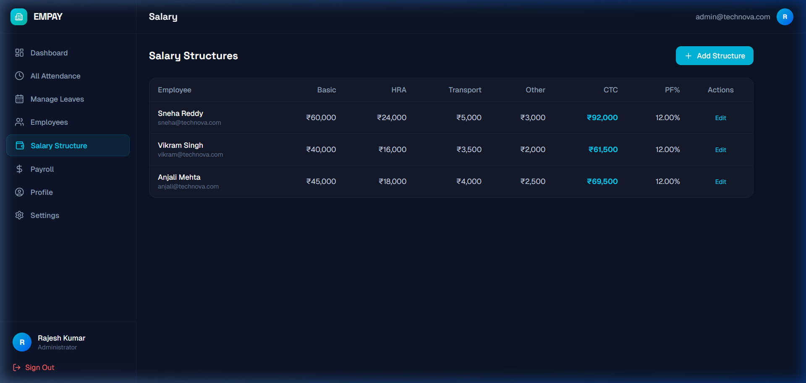
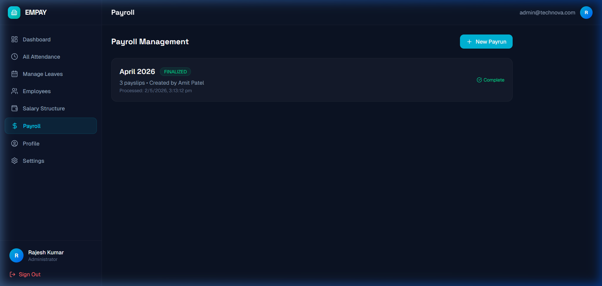

<div align="center">

# ⚡ EmPay — Smart HR Management System

**A modern, full-stack HR platform for managing employees, attendance, leave, salary structures, and payroll processing.**

[](https://djangoproject.com)
[](https://react.dev)
[](https://typescriptlang.org)
[](https://tailwindcss.com)

</div>

---

## 📸 Screenshots

### Landing Page


### Login


### Dashboard (Admin View)


### Employee Directory


### Salary Structures


### Payroll Management


---

## 🌟 Features

### 👥 Employee Management
- Complete employee lifecycle (create, update, deactivate)
- Role-based access: **Admin**, **HR Officer**, **Payroll Officer**, **Employee**
- Organization-scoped data isolation

### ⏰ Attendance Tracking
- Real-time check-in / check-out with automatic working hours calculation
- Monthly attendance history with filtering
- HR/Admin view of all organizational attendance

### 🏖️ Leave Management
- Apply, track, and manage leave requests
- Leave types: Annual, Sick, Personal, Casual
- Auto-balance deduction on approval with overlap detection

### 💰 Payroll Processing
- Configurable salary structures (Basic + HRA + Transport + Allowances)
- Automated payrun lifecycle: **Draft → Process → Finalize**
- Pro-rated calculations for mid-month joiners
- Detailed payslips with earnings/deductions breakdown

### 📊 Analytics Dashboard
- Role-scoped KPI cards (attendance, leave balance, payroll)
- Interactive charts (Recharts) — attendance trends, department distribution
- Payroll summary with gross/net/deduction totals

### 🔐 Security
- JWT authentication with auto-refresh
- Role-based permission system (4 levels)
- Protected routes on both frontend and backend

---

## 🏗️ Tech Stack

| Layer | Technology |
|---|---|
| **Frontend** | React 19, TypeScript, Vite 8, Tailwind CSS 4 |
| **UI** | Lucide Icons, Recharts, Framer Motion, React Hot Toast |
| **Backend** | Django 5.1, Django REST Framework |
| **Auth** | JWT (SimpleJWT) with access + refresh tokens |
| **Database** | PostgreSQL (production) / SQLite (development) |
| **Deployment** | Docker, Docker Compose, Gunicorn, WhiteNoise |

---

## 🚀 Quick Start

### Prerequisites
- Python 3.10+
- Node.js 18+
- npm 9+

### 1. Clone the repository
```bash
git clone https://github.com/parth-shinge/EmPay-Smart-Human-Resource-Management-System.git
cd EmPay-Smart-Human-Resource-Management-System
```

### 2. Backend Setup
```bash
cd backend
pip install -r requirements.txt
cp .env.example .env        # Edit if needed
python manage.py migrate
python manage.py seed_demo_data
python manage.py runserver 0.0.0.0:8000
```

### 3. Frontend Setup (new terminal)
```bash
cd frontend
npm install
npm run dev
```

### 4. Open in browser
```
http://localhost:5173
```

---

## 🐳 Docker Setup

```bash
docker-compose up --build
docker exec empay_backend python manage.py migrate
docker exec empay_backend python manage.py seed_demo_data
```

Access at: `http://localhost:5173` (frontend) and `http://localhost:8000` (API)

---

## 🔑 Demo Credentials

| Role | Email | Password |
|---|---|---|
| **Admin** | admin@technova.com | Admin@123 |
| **HR Officer** | hr@technova.com | Officer@123 |
| **Payroll Officer** | payroll@technova.com | Officer@123 |
| **Employee** | sneha@technova.com | Emp@12345 |
| **Employee** | vikram@technova.com | Emp@12345 |
| **Employee** | anjali@technova.com | Emp@12345 |

---

## 📁 Project Structure

```
EmPay/
├── backend/
│   ├── apps/
│   │   ├── accounts/       # User, Org, Auth, Employee CRUD
│   │   ├── attendance/     # Check-in/out, attendance records
│   │   ├── leave/          # Leave types, allocations, requests
│   │   ├── payroll/        # Salary structures, payruns, payslips
│   │   └── dashboard/      # Aggregated analytics APIs
│   ├── config/             # Django settings, URLs, WSGI
│   ├── Dockerfile
│   └── requirements.txt
├── frontend/
│   ├── src/
│   │   ├── components/     # DashboardLayout, ProtectedRoute
│   │   ├── context/        # AuthContext (JWT state management)
│   │   ├── lib/            # Axios API client with interceptors
│   │   └── pages/          # 16 page components
│   ├── Dockerfile
│   └── package.json
├── docker-compose.yml
└── README.md
```

---

## 🛣️ API Endpoints

| Module | Endpoint | Methods | Auth |
|---|---|---|---|
| Auth | `/api/auth/register/` | POST | Public |
| Auth | `/api/auth/login/` | POST | Public |
| Auth | `/api/auth/profile/` | GET, PATCH | JWT |
| Employees | `/api/employees/` | GET, POST | HR/Admin |
| Employees | `/api/employees/:id/` | GET, PATCH, DELETE | HR/Admin |
| Attendance | `/api/attendance/checkin/` | POST | Employee |
| Attendance | `/api/attendance/checkout/` | POST | Employee |
| Attendance | `/api/attendance/my/` | GET | JWT |
| Attendance | `/api/attendance/all/` | GET | HR/Admin |
| Leave | `/api/leave/types/` | GET | JWT |
| Leave | `/api/leave/balance/` | GET | JWT |
| Leave | `/api/leave/requests/` | GET, POST | JWT |
| Leave | `/api/leave/requests/:id/decide/` | POST | Admin/Payroll |
| Salary | `/api/salary/structure/` | GET, POST | Payroll/Admin |
| Payroll | `/api/payroll/payruns/` | GET, POST | Payroll/Admin |
| Payroll | `/api/payroll/payruns/:id/process/` | POST | Payroll/Admin |
| Payroll | `/api/payroll/payruns/:id/finalize/` | POST | Payroll/Admin |
| Payroll | `/api/payroll/payslips/` | GET | JWT |
| Dashboard | `/api/dashboard/stats/` | GET | JWT |

---

<div align="center">

**Built with ❤️ for the Hackathon**

</div>
